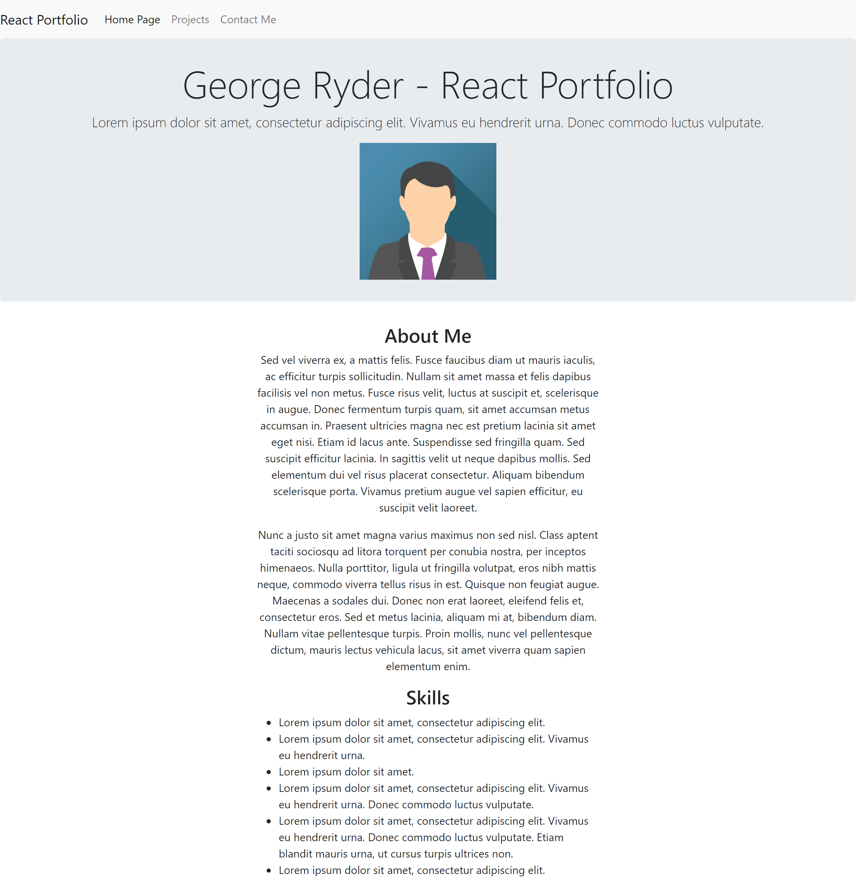

# George Ryder - React Portfolio

## Description

My main motivation behind building this project was to learn the basics of how to use react. Before this project was built, I had little idea as to what react was or how it could be used. Now, thanks to this portofolio, I am starting to develop an understanding of how to use react. I learnt a lot about how it works and how parts of each website can be broken down into components for reusable code. I also learnt a lot more about using props and functions within each component and page to gather information from a JSON file. I also learnt more about routing using react which can be seen in the Navbar where each 'tab' creates a new page despite the project being a single page application. Building this project has also helped me solve the problem of having a portfolio to show potential recruiters and employers. Whilst I have had portfolios in the past, such as one made using bootstrap, since this uses JS and React it will show employers that I have an understanding of this popular framework and will hopefully open up more oppurtunities for me.

Installation:

GitHub repository: https://github.com/NotGeorgeHere/React-Portfolio

Live Deployment Link: 

Usage:

